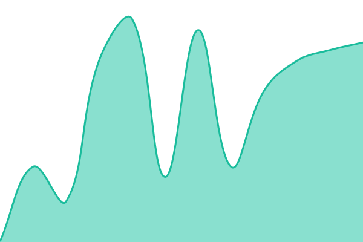

# [📈 Live Status](https://status.gettrucare.com): <!--live status--> **🟧 Partial outage**

This repository contains the open-source uptime monitor and status page for [TrucareOS-Dev](https://status.gettrucare.com), powered by [Upptime](https://github.com/upptime/upptime).

With [Upptime](https://upptime.js.org), you can get your own unlimited and free uptime monitor and status page, powered entirely by a GitHub repository. We use [Issues](https://github.com/TrucareOS-Dev/upptime/issues) as incident reports, [Actions](https://github.com/TrucareOS-Dev/upptime/actions) as uptime monitors, and [Pages](https://status.gettrucare.com) for the status page.

<!--start: status pages-->
<!-- This summary is generated by Upptime (https://github.com/upptime/upptime) -->
<!-- Do not edit this manually, your changes will be overwritten -->
<!-- prettier-ignore -->
| URL | Status | History | Response Time | Uptime |
| --- | ------ | ------- | ------------- | ------ |
|  Prod Rev | 🟩 Up | [prod-rev.yml](https://github.com/TrucareOS-Dev/upptime/commits/HEAD/history/prod-rev.yml) | 

 140ms
     
 | 

<a href="https://status.gettrucare.com/history/prod-rev">100.00%</a>
    

|  Prod Cred | 🟩 Up | [prod-cred.yml](https://github.com/TrucareOS-Dev/upptime/commits/HEAD/history/prod-cred.yml) | 

 152ms
     
 | 

<a href="https://status.gettrucare.com/history/prod-cred">100.00%</a>
    

|  [Prod Connect](SECRET_SITE_PROD_CONNECT) | 🟥 Down | [prod-connect.yml](https://github.com/TrucareOS-Dev/upptime/commits/HEAD/history/prod-connect.yml) | 

 0ms
     
 | 

<a href="https://status.gettrucare.com/history/prod-connect">0.00%</a>
    

|  Prod API Docs | 🟩 Up | [prod-api-docs.yml](https://github.com/TrucareOS-Dev/upptime/commits/HEAD/history/prod-api-docs.yml) | 

 155ms
     
 | 

<a href="https://status.gettrucare.com/history/prod-api-docs">0.00%</a>
    

|  Prod Portal | 🟩 Up | [prod-portal.yml](https://github.com/TrucareOS-Dev/upptime/commits/HEAD/history/prod-portal.yml) | 

 149ms
     
 | 

<a href="https://status.gettrucare.com/history/prod-portal">0.00%</a>
    

|  Prod Developer Portal | 🟩 Up | [prod-developer-portal.yml](https://github.com/TrucareOS-Dev/upptime/commits/HEAD/history/prod-developer-portal.yml) | 

 133ms
     
 | 

<a href="https://status.gettrucare.com/history/prod-developer-portal">0.00%</a>
    

|  Prod Admin | 🟩 Up | [prod-admin.yml](https://github.com/TrucareOS-Dev/upptime/commits/HEAD/history/prod-admin.yml) | 

 103ms
     
 | 

<a href="https://status.gettrucare.com/history/prod-admin">0.00%</a>
    

<!--end: status pages-->

[**Visit our status website →**](https://status.gettrucare.com)

## 📄 License

- Powered by: [Upptime](https://github.com/upptime/upptime)
- Code: [MIT](./LICENSE) © [Anand Chowdhary](https://anandchowdhary.com), supported by [Pabio](https://pabio.com)
- Data in the `./history` directory: [Open Database License](https://opendatacommons.org/licenses/odbl/1-0/)
